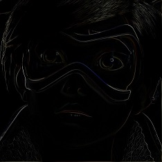

# Digital Image Processing
This is a project created by Alejandro Sans (sansalejandro@gmail.com) and Víctor Felipe as a project for a Digital Image Processing course (Universidad Central de Venezuela). 

This project shows multiple techniques of Image Processing made on a simple application in C#

When you run this project, you will see a window with a menu:

- **File**
-- **Open**: Browse an image and open it on the editor.
-- **Reopen**: Reopen the original image.
-- **Save**: Save the current image on chosen path.
-- **Exit**: Quit the editor.
- **Show**
-- **Info**: Show the dimensions and unique colors of the current image.
-- **Histogram**: Show the histogram of the current image in RGB.
- **Generate**
-- **Grayscale**: Create a grayscale of the current image.
-- **Equalization**: Equalize the current image.
-- **Contrast**: Show the histogram of the current image and allow you to modify the contrast of the RGB by choosing what pixels and position to contrast of the current image.
-- **Binarize**: Create a binarize image (just black and whites) of the current image.
-- **Precalculus**: Given a chosen path with images and the desirable dimension, create a precalculus of the images to generate a mosaic.
-- **Mosaic**: This button can only be activated after the precalculus was chosen. Generate a mosaic of the current image with the image chosen on the path of the precalculus.
- **Matrix of morphology**: This menu section allows you to choose the filter matrix for *Dilatation*, *Erotion*, *Opening*, *Closing* on the apply section (for binarize image only).
-- **Ones**: Select a matrix of ones.
-- **Identity**: Select a matrix of identity.
-- **Cross**: Select a cross matrix.
-- **X**: Select an "x" matrix.
-- **Matrix of convolution**: This menu section allows you to choose the filter matrix for *Apply Custom Matrix* on the apply menu section for a convolution filter.
-- **Custom 3x3**: Open a dialog of a matrix of 3 per 3 to create for a convolution filter.
-- **Custom 5x5**: Open a dialog of a matrix of 5 per 5 to create for a convolution filter.
-- **Custom 7x7**: Open a dialog of a matrix of 7 per 7 to create for a convolution filter.
- **Apply**: Apply filters on the current image.
-- **Sobel**: Apply Sobel filter on the current image (edge detection).
-- **Roberts**: Apply Roberts filter on the current image (edge detection).
-- **Prewitt**: Apply Prewitt filter on the current image (edge detection).
-- **Average**: Apply a filter calculating the average of every pixel with its surrounding.
-- **Median**: Apply a filter calculating the median of every pixel with its surrounding.
-- **Laplace 4**: Use the Laplacian 4 matrix for edge detection.
-- **Laplace 8**: Use the Laplacian 8 matrix for edge detection.
-- **Dilatation**: Only applicable on binarize image. Extend the white area of a binarize image.
-- **Erosion**: Only applicable on binarize image. Contract the white area of a binarize image.
-- **Opening**: Only applicable on binarize image. Applies an erosion followed by a dilatation.
-- **Closing**: Only applicable on binarize image. Applies a dilatation followed by an erosion.
-- **White Top Hat**: Create a grayscale image, binarize a copy of it, make an opening of the binarize image and subtract the resultant image to the grayscale image.
-- **Black Top Hat**: Create a grayscale image, binarize a copy of it, make a closing of the binarize image and subtract the grayscale image to the resultant image.
-- **Apply Custom Matrix**: Use the matrix created on menu section *Matrix of convolution* to filter the image.
- **Transform**: Apply transformation to the image.
-- **Scale**: Scale the current image.
-- **RotateCW**: Rotate the image clock-wise.
-- **RotateCCW**: Rotate the image counter clock-wise.
- **Comic**: CURRENTLY NOT WORKING.

# Compiling

Just need to have Visual Studio 2015 and compile it!

# Images

Here is the original image and some images generated by the application:

